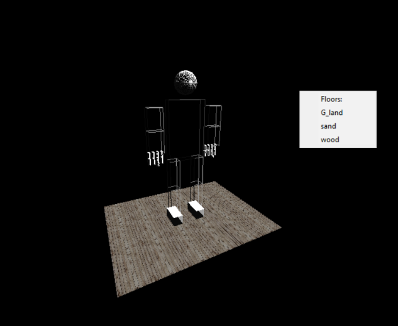
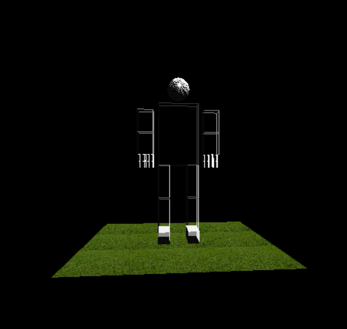
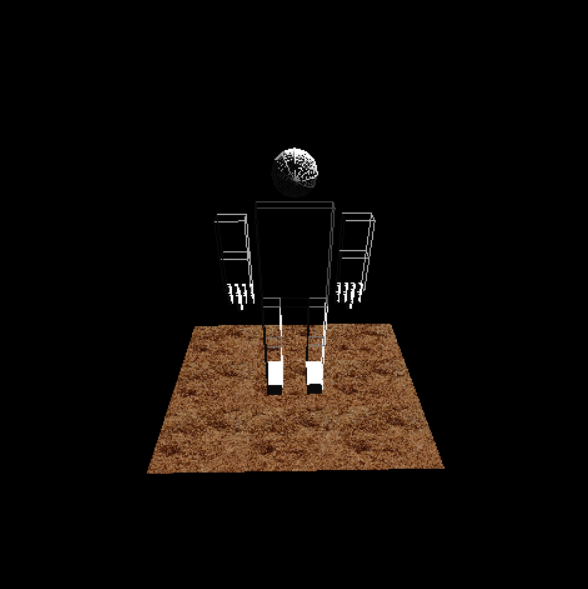
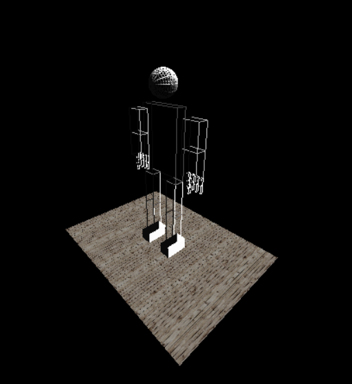

# Texture Mapping, Object Loading and Animation
* ## We have used three different Floors (wood, sand, green land)
* ## We applied lightening using Distant light source and point light source
* ## We choose the types of floor, by right click the mouse, from the below menu

* ## Green land floor 

* ## Sand floor 

* ## Wooden floor 

